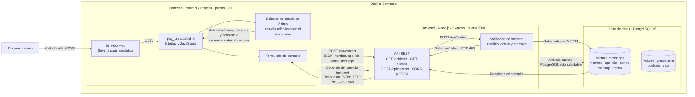

# Diagrama del proyecto Contigo

```mermaid
flowchart LR
    persona["Persona usuaria"]

    subgraph docker["Docker Compose"]
        subgraph frontend["Frontend · Node.js / Express · puerto 3000"]
            web["Servidor web<br/>Sirve la página estática"]
            page["pag_principal.html<br/>Interfaz y JavaScript"]
            mood["Selector de estado de ánimo<br/>Actualización local en el navegador"]
            form["Formulario de contacto"]

            web -->|"GET /"| page
            page --> mood
            page --> form
        end

        subgraph backend["Backend · Node.js / Express · puerto 3001"]
            api["API REST<br/>GET /api/hello · GET /health<br/>POST /api/contact · CORS y JSON"]
            validation["Validación de nombre,<br/>apellido, correo y mensaje"]

            api -->|"POST /api/contact"| validation
        end

        subgraph database["Base de datos · PostgreSQL 16"]
            table[("contact_messages<br/>nombre · apellido · correo<br/>mensaje · fecha")]
            volume[("Volumen persistente<br/>postgres_data")]
            table --- volume
        end

        backend -.->|"Arranca cuando PostgreSQL está saludable"| database
        frontend -.->|"Depende del servicio backend"| backend
    end

    persona -->|"Visita localhost:3000"| web
    mood -->|"Actualiza ánimo, consejos y porcentaje<br/>sin enviar datos al servidor"| page
    form -->|"POST /api/contact<br/>JSON: nombre, apellido, email, mensaje"| api
    validation -->|"Datos válidos: INSERT"| table
    validation -->|"Datos inválidos: HTTP 400"| api
    table -->|"Resultado de consulta"| api
    api -->|"Respuesta JSON: HTTP 201, 400 o 500"| form
```
